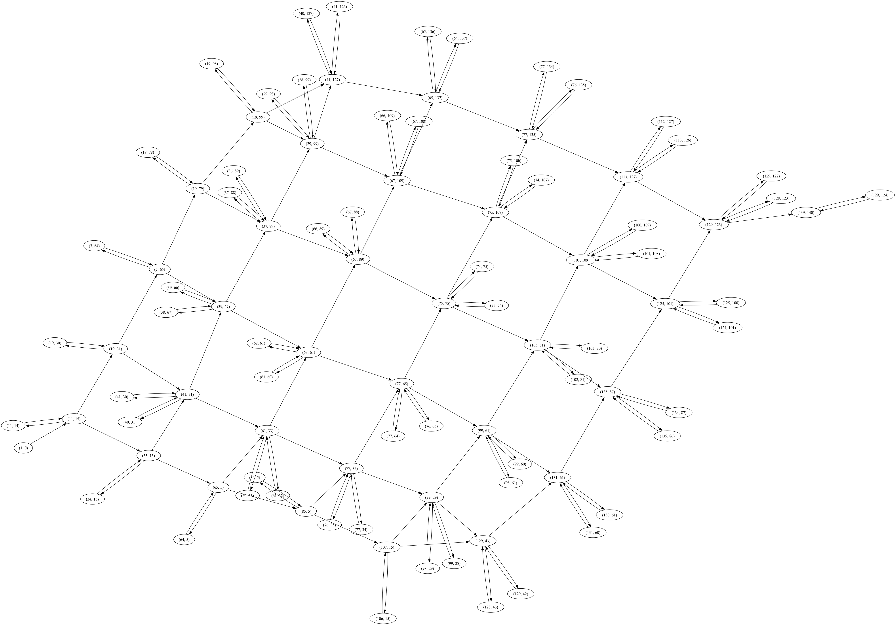

# Days worth to note in 2023

## Day 5

[Day 5](5/README.md)

We need to map numbers to "ranges" and then find our an overlaping ranges (min/max).
Very similar to [Day 2022/4](../2022/4/README.md)

Here I learned that we can use `else` statement for `for`

## Day 10

[Day 10](10/README.md)

Here we have a pipe loop - and it's hard to calculate a space "inside a loop". Here is my first usage of Shapely libary
that can calculate a border and area inisde a `Polygon`

## Day 12

[Day 12](12/README.md)

Typical DP and recursive pattern matching

## Day 17

[Day 17](17/README.md)

Here we travel across 2D space - it's crucial to build a correct Graph with a proper weightages - then calculation of a
shortest path.

## Day 18

[Day 18](18/README.md)

Traverse through 2d space and calculate then area from points - Shapely library

## Day 20

[Day 20](20/README.md)

Simulate state-machine and guess the code. After a visualization you can distinguish how it works - strongly depends on
an input data

## Day 21

[Day 21](21/README.md)

* Part I is just 2D graph scanning (how many empty cels we reach in 64 steps)
* Part II - **infinite map** - so going out of N you are on a S border of a map. Here we need to use math and statistics
  provided. Proposed number of steps here `26501365` according to WolframAlpha was `202300 * 131 + 65` where `65` is a
  half of a grid. From few examples we can simple learn that this can be calculated
  `lambda x: 14881 * x ** 2 - 14821 * x + 3682`. This is a solution proposed
  by [Wolfram Alpha](https://www.wolframalpha.com/input?i=3742%2C33564%2C93148%2C182494) based on 4 samples

## Day 22

[Day 22](22/README.md)

Overlapping Cubes (3D) and how they stuck on each other. Then you need to calculate a heigh when they fall down (so
compress over z)

## Day 23

[Day 23](23/README.md)

Scanning through 2D graph but with a very long "corridors". Here it's good to generate "minor graphs" and compress nodes
with only 2 connections
It can simplify a shortest path generation a lot

## Day 24

[Day 24](24/README.md)

### Part I

Find out a colliding lines in 2D - I used Sympy and it took 1m. Then compilation to numpy was working on an acceptable
level (500ms). Using a pure math from a StackOverflow was boosting a speed (39ms)

### Part II

Was a modification of an equation and transformation to 3D- to find a time where all those cubes where in the same
place - Sumpy here works based on first few equations

## Day 25

[Day 25](25/README.md)

A question straight about a graph
theorem - [Connected Components](https://en.wikipedia.org/wiki/Component_(graph_theory))
and [Minimum edge cuts](https://en.wikipedia.org/wiki/Minimum_cut). So using a NetworkX you can
calculate a solution without any implementation.

