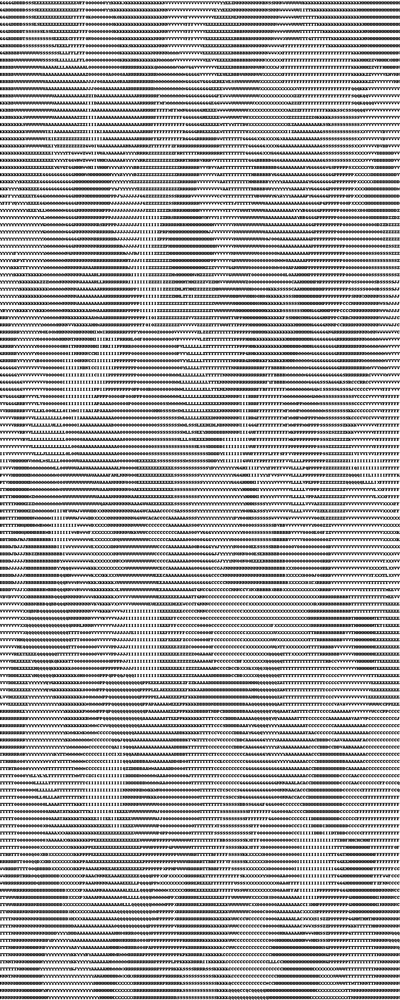
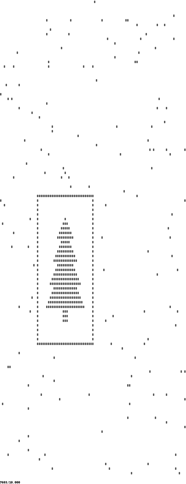
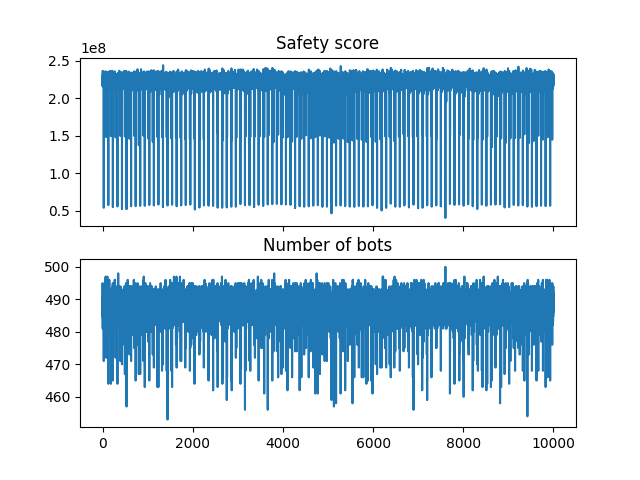
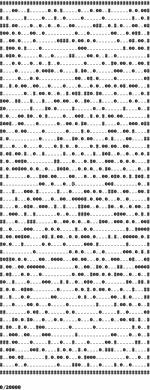
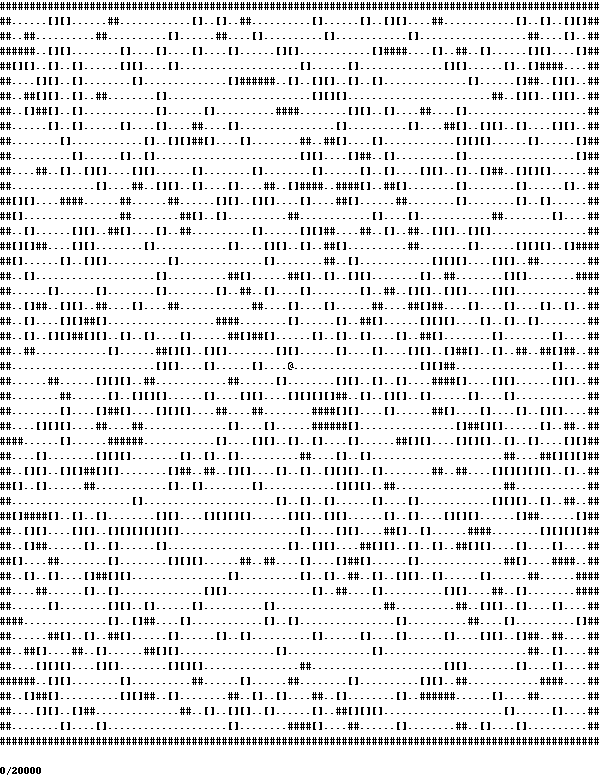
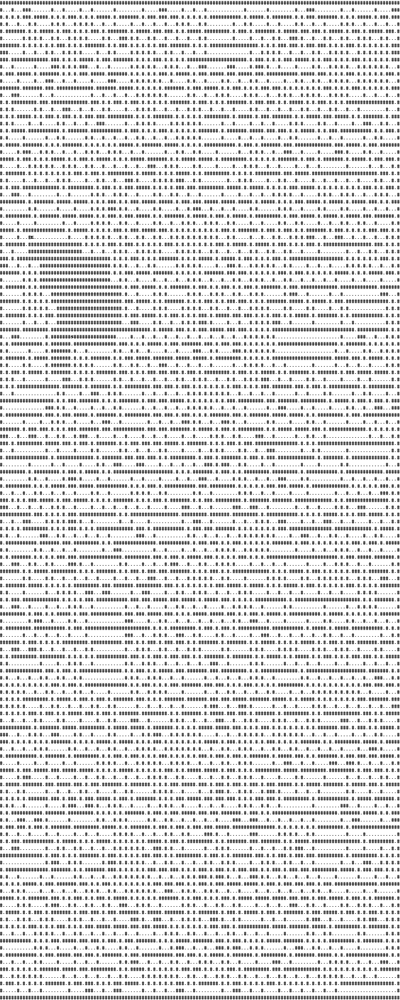
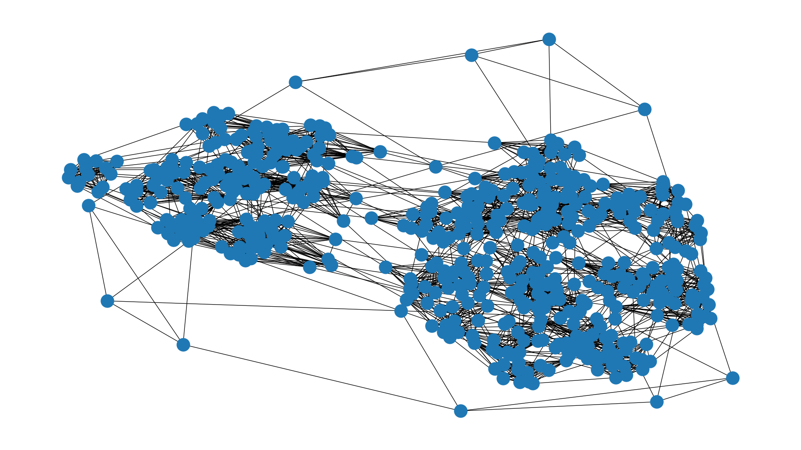

# Days worth to note in 2024

## Day 11

[Day 11](11/README.md)

Simulate the same stones at once - so increment counters (and don't count particular stones)
When there is a step that generates a new stone - just create a numbers of them at once - don't build a string
representation!

## Day 12

[Day 12](12/README.md)

Use NetworkX to segment areas (not connected graphs) and then use Shapely to calculate area and border length (and
elements of a border - after simplification)

To build a proper shape - we can join "boxes" (x, y, x+1, y+1) - and then we can use union to join all of them - it wil
create `Polygon`.
Additionally Shapely can distinguish polygons with "holes" - and properly calculate many "borders".

## Day 13

[Day 13](13/README.md)

Use Sympy to solve two equations with two variables - boring as for day 13

## Day 14

[Day 14](14/README.md)

Detect a Christmas Tree! Very non-well defined problem, and data prepared to match multiple cases at the "magic time" -
no collisions at this point, and lowest "safety score" (metric from part I) because almost all the bots are in one
quadrant - **well prepared!**

You can spot minimum safety score or maximum number of bots in the same area (in this case 7603)

## Day 15

[Day 15](15/README.md)

Moving "group of objects" on a grid - with some rules

## Day 16

[Day 16](16/README.md)

Moves on a 2D area converted to a weighted graph with different "Weights". When using a complex numbers you can easily
rotate the direction - then listing all shortest paths. Here quite important was to build a proper grid where node is
both: position and orientation

## Day 17

[Day 17](17/README.md)

Evaluation bytecode. One of **the worsts** days as multiple assumptions needs to be done based on a data, not an
algorithm.
Finally you have to "deduct" that each 3 bits are controlling each section - so then bruteforce

## Day 18

[Day 18](18/README.md)

Remove nodes from NetworkX as long as there is no connection between "start" and "end".

You have numbers that are just X/Y of a point - so yet another 2D area manipulation.

## Day 19

[Day 19](19/README.md)

Typical DP problem - count how many ways we can get to the end

# Day 20

[Day 20](20/README.md)

Looking for a "shortcuts" in a graph. Usage of a KDTree can speedup the lookup of a "nearest neighbours"

There are another "hidden" data - there is a very long path across a whole image so any shortuct will be always between
points from a "shortest path"

## Day 21

[Day 21](21/README.md)

Robot is controlling other robots. Typical DP problem - you need to focus on an outcome - to calculate length you don't
have to build a string, just sum partial substrings (and use memoization to keep the same strings already counted)

## Day 23

[Daty 23](23/README.md)

This is a task related to all the Graph theorem - [cycles](https://en.wikipedia.org/wiki/Cycle_(graph_theory))
and [cliques](https://en.wikipedia.org/wiki/Clique_(graph_theory)).

Part II was strongly focused on algorithms
like [Bron–Kerbosch algorithm](https://en.wikipedia.org/wiki/Bron%E2%80%93Kerbosch_algorithm)